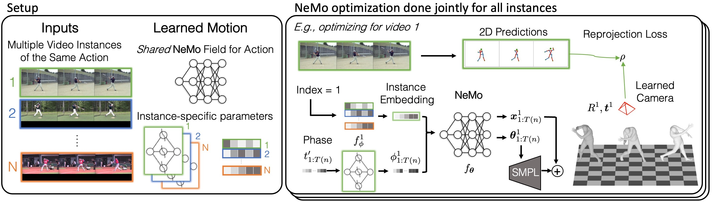

# NeMo [CVPR2023 Highlight]

This repo contains the official PyTorch implementation of our paper:
  
**NeMo: 3D Neural Motion Fields from Multiple Video Instances of the Same Action** 
*by* [Kuan-Chieh (Jackson) Wang](https://wangkua1.github.io/), [Zhenzhen Weng](https://zzweng.github.io/), [Maria Xenochristou](https://mariaxen.github.io/), [Joao Pedro Araujo](https://scholar.google.com/citations?user=fs8k5acAAAAJ&hl=en), [Jeffrey Gu](https://its-gucci.github.io/), [C. Karen Liu](https://tml.stanford.edu/), [Serena Yeung](https://ai.stanford.edu/~syyeung/)

**([Project Page 🌐](https://sites.google.com/view/nemo-neural-motion-field) | [ArXiv 📄](https://arxiv.org/abs/2212.13660))**


.gif)

# Installation
### Environment 
1. Clone this repository.
```
git clone git@github.com:wangkua1/nemo-cvpr2023.git
```

2. Create a conda environment using the provided environment file.
```
conda env create -f environment.yml
```
Then, activate the conda environment using 
```
conda active nemo
```

3. Pip install the missing packages using the provided requirements file.
```
pip install -r requirements.txt
```


### Other software downloads
1. Create a directory `software`.

2. Download the required components:
* "V02_05" -- requied by human_body_prior.  Follow the original instructions at the [VPoser github page](https://github.com/nghorbani/human_body_prior).
* "spin_data" -- Follow the original instructions at the [SPIN github page](https://github.com/nkolot/SPIN).
* "smpl" -- Follow the original instructions at [their website](https://smpl.is.tue.mpg.de/).

Alternatively, download them at this [link](https://drive.google.com/drive/folders/1mEqMgHRndJK_4skVP-3v4mxUIS0FapQk?usp=share_link). 
Note, we only provide these for the purpose of reproducing our work, *please respect the original instruction, license, and copyright*.


# Dataset: *NeMo-MoCap*
1. Download the dataset from this [Google Drive folder](https://drive.google.com/drive/folders/141-mBNwaSxYa4TB7HR4emDbMJ3ykc964?usp=share_link).
It should have a file structure as follows:
```
/nemo
-- /data
  | -- /videos
  |   | -- <ACTION>.<INDEX>.mp4
  |   |  ......
  | -- /exps
  |   | -- /mymocap_<ACTION>
  |   |    | -- /<ACTION>.<INDEX>
  |   |    | -- /<ACTION>.<INDEX>.mp4_gt
  |   |    | -- /<ACTION>.<INDEX>.mp4_openpose
  |   |  ......
  | -- /mocap
  |   |    | -- <ACTION>.<INDEX>.pkl
  |   |  ......
  | -- opt_cam_IMG_6287.pt
  | -- opt_cam_IMG_6289.pt

```

2. Conver the mp4 videos into frames.
```bash
python -m scripts.video_to_frames
```


# Running NeMo

A example inference script for running NeMo on the "Baseball Pitch" motion on the NeMo-MoCap dataset is provided `run_scripts/examples`.  
You can run it locally using the following command:
```
bash run_scripts_examples/nemomocap-example.sh 0
```
or launching a SLURM job with `sbatch` using
```
bash run_scripts_examples/nemomocap-example.sh 1
```


# Acknowledgement
NeMo is built on many other great works, including
[VPoser](https://github.com/nghorbani/human_body_prior),
[SPIN](https://github.com/nkolot/SPIN),
[SMPL](https://smpl.is.tue.mpg.de/),
[HMR](https://github.com/akanazawa/hmr),
[VIBE](https://github.com/mkocabas/VIBE),
[DAPA](https://github.com/zzweng/dapa_release),
[GLAMR](https://github.com/NVlabs/GLAMR).

# Citation
If you find this work useful, please consider citing:
```
@inproceedings{wang2022nemo,
  title={NeMo: 3D Neural Motion Fields from Multiple Video Instances of the Same Action},
  author={Wang, Kuan-Chieh and Weng, Zhenzhen and Xenochristou, Maria and Araujo, Joao Pedro and Gu, Jeffrey and Liu, C Karen and Yeung, Serena},
  booktitle={Proceedings of the IEEE/CVF Conference on Computer Vision and Pattern Recognition (CVPR)},
  year={2023},
  arxiv={2212.13660}
}
```
